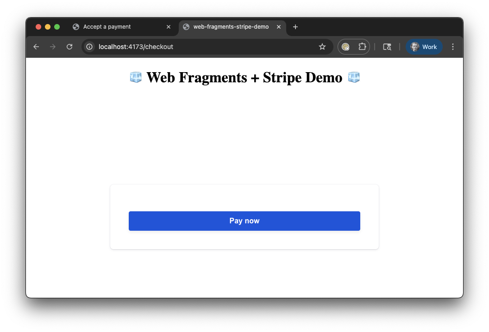

# Web Fragments + Stripe Elements SDK repro

This repro uses Web Fragments and Stripe Elements SDK to demonstrate issues caused by cross-origin iframes that seemingly don't communicate well any more once they are run in the Web Fragment container.

This repro uses a custom build of Web Fragments (WF) from this PR: https://github.com/web-fragments/web-fragments/pull/219 specifically at commit [13c5dbc](https://github.com/web-fragments/web-fragments/pull/219/commits/13c5dbc9ee54a3bc8969884a5f528ba1cdff33ea) built by [the WF CI](https://github.com/web-fragments/web-fragments/pull/219/checks?check_run_id=50523156880). This is dependency is configured in `packages/host-app/package.json`.

## Running

### Set up `.env.local` file

Create a `.env.local` file in the root of the project with the following content:

```bash
cp packages/stripe-fragment-app/.env{,.local}
```

Edit the `.env.local` file to add your Stripe keys.

### Run the repro

```bash
pnpm start
```

## Expected vs Actual

Expected: The two browser tabs opened by this repro should display the Stripe checkout form.

Actual: Only one tab, running the app without WF displays the Stripe checkout form. The WF tab renders the UI produced by the fragment host application, as well as the react application in `packages/stripe-fragment-app`, but the part of the UI rendered by Stripe within an iframe is not rendered — the iframe's document contains an empty root element and no DOM nodes.


### Rendered UI in standalone mode (correct)


### Rendered UI embedded as a Web Fragment (incorrect)


